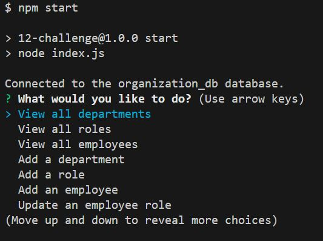
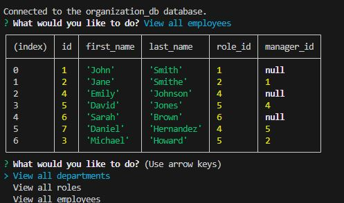

# My Organization Database Project

## Description
This project entailed the creation of an employee database with multiple tables containing data on the organization's various  departments, roles within those departments, and employees fulfilling those roles.  Further, the project necessitated a command-line application that allows users to efficiently add to or update information on those tables without needing any specific SQL query knowledge.

## Installation
This is a node project, so installation of this project will require the user to have the latest version of nodejs downloaded.  Further, this project necessitates the use of postgreSQL, which the user must also have downloaded. To install this project, one must first clone this repo to their local device.  Then, navigate to the repository in their local integrated development environment and install the necessary packages using the "npm install" command in the terminal.  The user will then need to create and seed their database within postgreSQL by navigating to the db folder of the project, logging into their postgres user, and running the commands "\i schema.sql" and "\i seeds.sql". Having done this, the user can now run the program from the command line with the command "npm start".  The series of prompts used to alter the tables  within the organization database will then begin.  If, at any point, the user would like to exit the application, they can either type "Ctrl + C" or choose the "Exit" option on the menu.

## Usage
Upon running the application, this is a screenshot of what the prompts will look like.  

Following the completion of all of the prompts, an .svg file will be generated in the "output" folder that will contain a logo looking similar to this (varying depending on user responses):

The following is a link to a walkthrough video that demonstrates all of the functionality of the program:
[Database Application Walkthrough Video]()

## Contributing
N/A

## Tests
N/A

## Credits
https://stackoverflow.com/questions/66626936/inquirer-js-populate-list-choices-from-sql-database

https://stackoverflow.com/questions/75291250/how-can-i-exit-inquirer-prompt-based-on-answer

